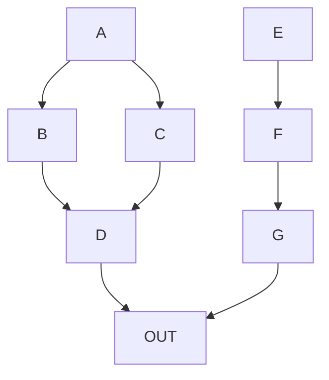

Mermaid diagrams provide a way to display graphs defined as plain text. Some markdown renderers support this as a plugin.  GitHub now supports it.

## example

You can define nodes like this in mermaid, and GitHub will now render them as a pretty graph diagram.  Its rendered in svg, so its searchable with `control f` and everything.

## Links

* [GitHub support announcement](https://github.blog/2022-02-14-include-diagrams-markdown-files-mermaid/)
* [mermaid docs](https://mermaid-js.github.io/mermaid/#/)

    
    
    <a class='prev' href='/til/gitignore-python'>
    

        <svg width="50px" height="50px" viewbox="0 0 24 24" fill="none" xmlns="http://www.w3.org/2000/svg">
            <path d="M13.5 8.25L9.75 12L13.5 15.75" stroke="var(--prevnext-color-angle)" stroke-width="1.5" stroke-linecap="round" stroke-linejoin="round"> </path>
        </svg>
        

            
prev

            
Python Respect the .gitignore

        

    </a>
    
    <a class='next' href='/til/git-revive-dead-files'>
    
        

            
next

            
Revive files from the dead with git

        

        <svg width="50px" height="50px" viewbox="0 0 24 24" fill="none" xmlns="http://www.w3.org/2000/svg">
            <path d="M10.5 15.75L14.25 12L10.5 8.25" stroke="var(--prevnext-color-angle)" stroke-width="1.5" stroke-linecap="round" stroke-linejoin="round"></path>
        </svg>
    </a>
  
